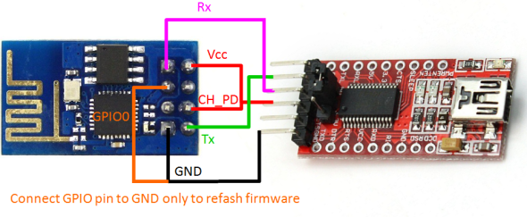

# Baby Qube

## Getting Started

  - Clone the project
  - Open the project in VS Code (with Platform IO extension installed)
  - To run the project select `release_esp01_1m` environment
  - Build and upload the code to ESP01 device

## Hardware pin out

## Programming ESP01 using FTDI

  - Connect `CH_PD` from ESP01 to VCC
  - Connect VCC and GND to FTDI VCC and GND
  - Connect `TX` of ESP01 to `RX` of FTDI
  - Connect `RX` of ESP01 to `TX` of FTDI
  - Connect `GPIO0` on ESP01 to GND (GPIO0 low puts ESP8266 into bootloader mode for downloading code)

To reset the ESP, connect `RST` to gronud for a brief moment. The chip will automatically restart.