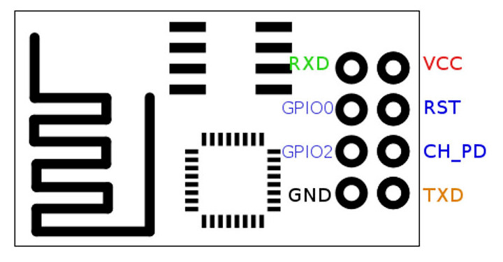

# Switch Node

## TODO

  1. Changing Mesh name and password. Otherwise homes that are side by side will share the data automatically. Which is wrong. We need to create unique mesh names and passwords
  2. Ability to change the priority of physical switch or cloud message.
  3. Add ability to perform an OTA update from gateway.

## Getting Started

  - Clone the project
  - Open the project in VS Code (with Platform IO extension installed)
  - To run the project select `release_esp01_1m` environment
  - Build and upload the code to ESP01 device

## Hardware pin out



## Programming ESP01 using FTDI

  - Connect `CH_PD` from ESP01 to VCC
  - Connect VCC and GND to FTDI VCC and GND
  - Connect `TX` of ESP01 to `RX` of FTDI
  - Connect `RX` of ESP01 to `TX` of FTDI
  - Connect `GPIO0` on ESP01 to GND (GPIO0 low puts ESP8266 into bootloader mode for downloading code)


To reset the ESP, connect `RST` to gronud for a brief moment. The chip will automatically restart.
Tx - GPIO 1
Rx - GPIO 3

## State Message
Every time the state of the device is updated. This JSON message will be generated and sent to the gateway.
```
{
  "t": 1,
  "rs": 1,
  "ss": 0,
  "p": 1
}
```

## Supported Configuration Messages
Configuration messages are those types of messages which the device would use to update it's state.

```
{
  "t": 1,  -> Type of the message, future proofing from
  "rs": 0, -> Current state of relay
  "p": 3  -> Current priority
}
```

Since IoT core sends the most recent configuration to the device. We need to have all the information required to update the state of the device. Even if it means sending the same information over the wire again.

Changes in configuration will be applied in the following order:
1. Check the type of message (for all type 1 messages)
2. Update the current state of relay
3. Update the priority of the device


## Iteracting with device
There are two GPIO pins using which you can interact with the device.
  1. **Relay Output Pin** - TX (GPIO 1). The relay will be driven on the basis of this output.
     - Pin HIGH / 5V -> Relay ON -> Appliance ON
     - Pin LOW / 0V -> Relay OFF -> Appliance OFF

  2. **Switch Input Pin** - Rx (GPIO 3). The physical state of the switch is known by reading this pin.
     - Pin reads HIGH / 5V -> Switch Off
     - Pin reads LOW / 0V / GND -> Switch is On

## Pins used on ESP01
  - `RXD` -> Switch input pin
  - `GPIO0` -> Debug serial interface RX pin
  - `GPIO2` -> Debug serial interface TX pin
  - `TXD` -> Relay output pin

## Debugging

  - **If the board keeps restarting without any reason.** -> Power ESP01 using a dedicated power supply. Use FTDI power supply **ONLY** for programming the board and for nothing else. If you use FTDI's power supply it would keep restarting with some error random error every now and then.